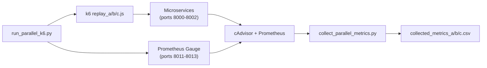

# Analisis Lengkap: Collected Metrics vs Combined Clarknet + Root Cause dari Script

## Jawaban: CPU/RAM/Latency Perlu Dites Lagi?

> [!CAUTION]
> **YA, CPU/RAM/Latency JUGA BERMASALAH dan perlu perhatian**, karena:

| Metrik | Hari 1-6 (Normal) | Hari 7-14 (Anomali) | Masalah |
|---|---|---|---|
| CPU Media (mean) | 7.2 – 7.5 | **0.88 – 1.04** | Turun 7x |
| CPU Content (mean) | 7.1 | **0.71 – 0.77** | Turun 9x |
| RAM Media (mean) | 284 – 489 MB | **152 MB** | Turun drastis |
| RAM Content (mean) | 211 – 273 MB | **156 – 159 MB** | Turun drastis |
| Latency Media (std) | 17.6 – 22.3 | **0.0** | Konstan 95ms, tidak ada variasi |
| Latency Content (std) | 15.9 – 19.4 | **0.0 – 0.68** | Hampir konstan |

**Root cause**: Sama dengan freeze RPS — ketika Prometheus query gagal mengembalikan data, script menulis **default value `0.0`** untuk CPU/RAM, dan saat freeze terjadi, nilai CPU/RAM/Latency ikut "stuck" di nilai terakhir yang berhasil di-query.

Artinya **semua kolom (bukan hanya RPS) terpengaruh oleh freeze**. Untuk prediksi workload, data CPU/RAM/Latency Hari 7-14 **tidak bisa langsung dipercaya**.

---

## Root Cause Analysis: Kenapa Terjadi Freeze?

Setelah membaca script di [skrip-percobaan/](file:///home/dimas/lstm-proactive-scaling-microservices-clarknet-docker-compose/skrip-percobaan), berikut arsitektur data collection:



### Bug #1: Prometheus Query Chunking Tanpa Deduplication

Di [collect_parallel_metrics.py](file:///home/dimas/lstm-proactive-scaling-microservices-clarknet-docker-compose/skrip-percobaan/collect_parallel_metrics.py#L48-L56):

```python
chunk_size = 7200  # 2 jam per chunk
curr_start = start_ts
while curr_start < end_ts:
    curr_end = min(curr_start + chunk_size, end_ts)
    results = query_prometheus_range(q, curr_start, curr_end, "1s")
    if results and len(results) > 0:
        combined_values.extend(results[0].get("values", []))  # ⚠️ BUG
    curr_start = curr_end  # ⚠️ Boundary overlap possible
```

**Masalah**: 
- `curr_end` dari chunk sebelumnya = `curr_start` chunk berikutnya → ada **1 timestamp yang overlap** di setiap boundary
- Jika Prometheus **gagal mengembalikan data** untuk suatu chunk (timeout, overload), chunk tersebut **dilewati begitu saja** → menghasilkan deretan `0.0` (default)
- **Tidak ada retry logic** sama sekali

### Bug #2: Gauge RPS Tidak Sinkron dengan Prometheus Scrape

Di [run_parallel_k6.py](file:///home/dimas/lstm-proactive-scaling-microservices-clarknet-docker-compose/skrip-percobaan/run_parallel_k6.py#L173-L205):

```python
for second in range(current_chunk_duration):
    gauge_media_a.set(m_a)    # Set gauge
    gauge_content_a.set(c_a)  # Set gauge
    # ... sleep until next second
```

Dan di collector ([L66-L69](file:///home/dimas/lstm-proactive-scaling-microservices-clarknet-docker-compose/skrip-percobaan/collect_parallel_metrics.py#L66-L69)):

```python
# Compensate for the 1-second Prometheus scrape delay / phase shift
idx = ts - start_ts - 1  # ⚠️ Manual offset
```

**Masalah**:
- Gauge di-set **tepat saat sleep selesai**, tapi Prometheus scrape interval bisa **tidak sinkron** (jitter ±0.5s)
- Offset `-1` di collector adalah **hard-coded compensation** yang tidak selalu akurat
- Ini menjelaskan **42 mismatch minor** pada Hari 1-6: race condition antara gauge update dan Prometheus scrape

### Bug #3: Freeze Disebabkan Prometheus Data Retention / Query Timeout

Untuk eksperimen Hari 7-14 (berjalan selama **7+ hari**):
- **Prometheus default retention** biasanya 15 hari, tapi **query_range** untuk dataset besar bisa **timeout**
- Script hanya punya `timeout=10` detik per request — untuk query 7200 data points per chunk, ini bisa **tidak cukup**
- Saat timeout terjadi → `query_prometheus_range()` return `[]` → chunk tetap berisi default `0.0`
- **Efek kumulatif**: semakin lama eksperimen berjalan, semakin banyak chunk yang timeout

### Bug #4: Tidak Ada Validasi/Deteksi Freeze Saat Collection

Script [collect_parallel_metrics.py](file:///home/dimas/lstm-proactive-scaling-microservices-clarknet-docker-compose/skrip-percobaan/collect_parallel_metrics.py) langsung menulis data ke CSV tanpa:
- ❌ Validasi apakah Prometheus mengembalikan data untuk semua timestamp
- ❌ Deteksi freeze/flatline patterns
- ❌ Warning jika ada data points yang missing
- ❌ Retry mechanism untuk failed queries

---

## Ringkasan Semua Masalah yang Ditemukan

| # | Masalah | Severity | Lokasi | Dampak |
|---|---|---|---|---|
| 1 | **Freeze periods** (metric collector stuck) | 🔴 Critical | Hari 7-14 | 29-45% data corrupted |
| 2 | **CPU/RAM/Latency anomali** (regime change) | 🔴 Critical | Hari 7-14 | CPU/RAM turun 7-9x, Latency konstan |
| 3 | **175 baris hilang** di combined Clarknet | 🟡 Medium | Hari 12-14 | 0.014% data missing |
| 4 | **42 mismatch minor** per file (Hari 1-6) | 🟢 Low | Hari 1-6 | 0.016% data, race condition |
| 5 | **No retry logic** pada Prometheus query | 🔴 Critical | Script | Silent data loss |
| 6 | **No freeze detection** saat collection | 🟡 Medium | Script | Tidak ada warning |
| 7 | **Chunk boundary overlap** | 🟢 Low | Script | Possible duplicate timestamp |

---

## Solusi

### Untuk Data yang Sudah Ada (Quick Fix)

Karena **RPS bisa diperbaiki dari Clarknet ground truth**, tapi **CPU/RAM/Latency tidak punya ground truth**:

1. **RPS**: Ganti semua kolom `rps_media` dan `rps_content` di collected metrics dengan data dari split Clarknet yang sudah dipecah
2. **CPU/RAM/Latency Hari 1-6**: Aman digunakan (hanya 42 mismatch minor di RPS, metrik infra tidak terpengaruh)
3. **CPU/RAM/Latency Hari 7-14**: 
   - **Opsi A**: Buang data Hari 7-14 dan hanya gunakan Hari 1-6 (data bersih)
   - **Opsi B**: Interpolasi — deteksi periode freeze, lalu interpolasi linear dari nilai sebelum dan sesudah freeze
   - **Opsi C**: Re-run eksperimen Hari 7-14 dengan script yang sudah diperbaiki

### Untuk Eksperimen Selanjutnya (Script Fix)

Perbaikan yang direkomendasikan pada script:

**1. Tambahkan retry logic pada Prometheus query:**
```python
def query_prometheus_range(query, start, end, step="1s", retries=3):
    for attempt in range(retries):
        try:
            r = requests.get(url, params=params, timeout=30)  # ← naikkan timeout
            if r.status_code == 200:
                return r.json()["data"]["result"]
        except Exception as e:
            print(f"Attempt {attempt+1}/{retries} failed: {e}")
            time.sleep(2 ** attempt)  # exponential backoff
    return []
```

**2. Tambahkan freeze detection dan warning:**
```python
# Setelah menulis CSV, validasi hasilnya
for key in series_data:
    values = series_data[key]
    # Deteksi consecutive identical values
    for i in range(1, len(values)):
        if values[i] == values[i-1]:
            streak += 1
        else:
            if streak >= 30:
                print(f"⚠️ FREEZE detected in {key}: {streak}s at index {i-streak}")
            streak = 0
```

**3. Fix chunk boundary overlap:**
```python
# Gunakan exclusive end untuk menghindari overlap
curr_end = min(curr_start + chunk_size - 1, end_ts)  # -1 untuk exclusive
```

**4. Gunakan deduplication saat merge chunks:**
```python
seen_timestamps = set()
for val in combined_values:
    ts = int(val[0])
    if ts not in seen_timestamps:
        seen_timestamps.add(ts)
        # process value
```

---

## Saran Nama Repository

| Nama | Cocok Untuk |
|---|---|
| **`microservice-workload-dataset`** | ✅ (Recommended) Repo data + analisis |
| `clarknet-microservice-workload` | Spesifik ke sumber data Clarknet |
| `workload-prediction-dataset` | Jika fokus pada prediksi |
| `autoscaling-workload-traces` | Jika fokus pada autoscaling |

> [!TIP]
> Rekomendasi: **`microservice-workload-dataset`** — cukup deskriptif dan general. Folder `olah-data` saat ini bisa langsung di-rename menjadi nama repo ini.
